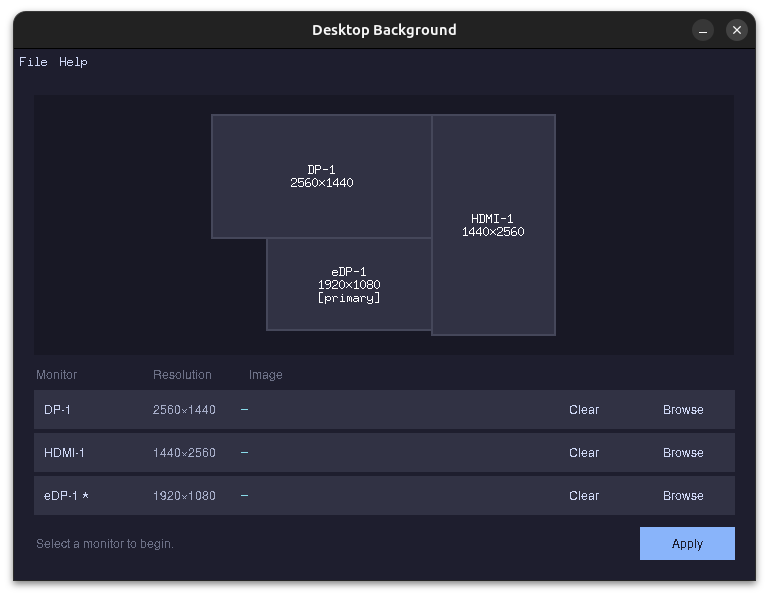

# fluffy.toothpaste

Multi-monitor desktop background manager. Set different wallpapers per monitor or stitch one image across all screens.



## Requirements

- Python 3.14+
- [uv](https://docs.astral.sh/uv/)

## Usage

```bash
make          # show available commands
make install  # sync dependencies
make run      # run the app
make test     # run tests
make lint     # check for lint errors
make fix      # auto-fix lint errors
make format   # format source code
make check    # lint + test (CI gate)
make clean    # remove cache artifacts
```
